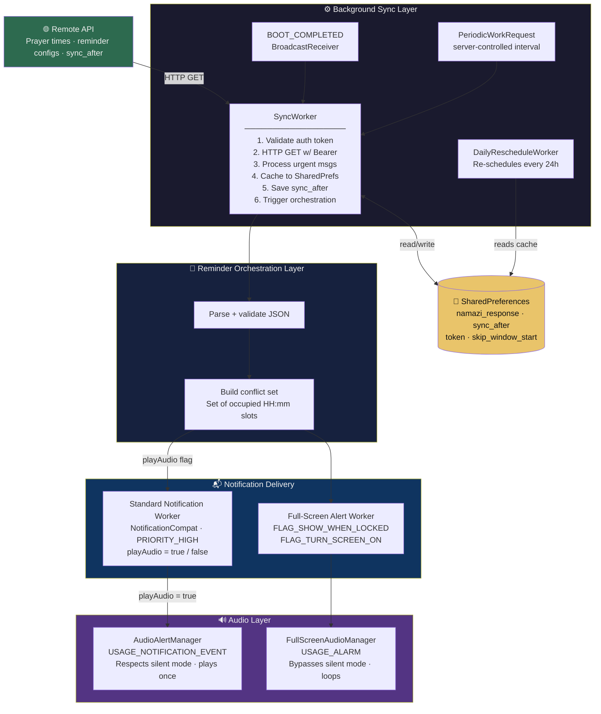

# 📱 Android Mosques Prayer Notification App

[](https://developer.android.com)
[](https://kotlinlang.org)
[](https://developer.android.com/topic/libraries/architecture/workmanager)
[](https://developer.android.com/jetpack/compose)
[](https://developer.android.com/about/versions/11)
[](https://play.google.com/store/apps/details?id=com.dynasol.tech.masjid.wala)

> **Portfolio Disclaimer:** This repository showcases my architecture design and technical decision-making for a production Android notification system I built solo. All code snippets are generic patterns recreated for portfolio purposes. No proprietary company code, screenshots, or internal business logic is included.

---

## 🎯 My Role & Contributions

I was **solely responsible** for designing and implementing the complete native notification infrastructure for **MasjidWala** — a production Android app on the Google Play Store. The app's core UI is a WebView loading remote content; my entire scope was the native Android layer.

### What I Built

- **Dual notification strategy** — standard lock-screen notifications + full-screen alarm-style alerts
- **Permission management** — SDK-conditional logic covering Android 11 through 15
- **Background sync engine** — WorkManager-based periodic polling with server-driven interval control
- **Audio system** — 10 configurable sounds, two separate audio streams (NOTIFICATION vs ALARM)
- **Conflict detection** — set-based algorithm preventing overlapping audio from simultaneous notification types
- **24-hour skip window** — timestamp-based persistence for the "Skip for Now" permission onboarding flow
- **Boot + daily recovery** — BroadcastReceiver and DailyRescheduleWorker to survive device restarts and calendar rollovers

---

## 🏗️ System Architecture



---

## 📐 Repository Structure

```
android-notification-system/
│
├── README.md                               ← You are here
│
├── docs/
│   ├── architecture.md                     ← Component breakdown + mermaid data flow
│   ├── permission-strategy.md              ← Android version matrix + mermaid onboarding flow
│   ├── audio-stream-decision.md            ← ALARM vs NOTIFICATION stream rationale
│   ├── conflict-resolution.md              ← Conflict algorithm + mermaid flowchart
│   └── skip-window-implementation.md       ← 24-hour window pattern + mermaid sequence
│
├── snippets/
│   ├── workmanager-setup.kt                ← Periodic + immediate + daily reschedule patterns
│   ├── permission-helper.kt                ← SDK-version conditional checks + PermissionStatus
│   ├── conflict-detection.kt               ← Set-based conflict algorithm with HH:mm helper
│   ├── audio-manager.kt                    ← Dual audio stream configuration side-by-side
│   └── timestamp-skip.kt                   ← TimestampWindowManager class + usage examples
│
└── diagrams/
    ├── architecture.mermaid                ← Full system component + data flow
    ├── sequence.mermaid                    ← End-to-end notification delivery sequence
    ├── permission-flow.mermaid             ← SDK-version permission decision tree
    ├── conflict-resolution.mermaid         ← Dual notification conflict algorithm
    ├── skip-window.mermaid                 ← 24-hour timestamp skip window flow
    └── architecture.txt                    ← ASCII fallback diagram
```

---

## 🔧 Key Technical Challenges & Solutions

### 1. Double Audio on Overlapping Notifications

**Problem:** When a full-screen alert and a standard reminder are scheduled for the same prayer time, both workers fire simultaneously — triggering two audio streams at once.

**Solution — Set-Based Conflict Detection:**

```kotlin
// Generic pattern — not production code
fun scheduleWithConflictDetection(
    fullScreenAlerts: List<Alert>,
    standardReminders: List<Reminder>
) {
    // Phase 1: Build a set of occupied minute-slots
    val occupiedSlots = fullScreenAlerts
        .map { toHourMinute(it.triggerTime) }
        .toSet()

    // Phase 2: Suppress audio on standard reminders that share a slot
    standardReminders.forEach { reminder ->
        val hasConflict = toHourMinute(reminder.triggerTime) in occupiedSlots
        scheduleStandardReminder(reminder, playAudio = !hasConflict)
    }

    // Phase 3: Full-screen alerts always play alarm audio
    fullScreenAlerts.forEach { scheduleFullScreenAlert(it) }
}
```

**Why HH:mm granularity?** Exact millisecond comparison is brittle due to parsing differences between server timestamps and locally-calculated times. Minute-level granularity matches user perception and eliminates false misses.

---

### 2. "Skip for Now" Reappearing After Process Kill

**Problem:** A one-shot boolean flag is consumed on first read. After a process kill or `CLEAR_TASK` restart, the flag is gone — the permission screen reappears even though the user skipped it 10 minutes ago.

**Solution — Timestamp-Based 24-Hour Window:**

```kotlin
// Generic pattern — not production code
class SkipWindowManager(private val prefs: SharedPreferences) {

    private val WINDOW_MS = 24 * 60 * 60 * 1000L

    fun markSkipped() {
        prefs.edit()
            .putLong("skip_window_start", System.currentTimeMillis())
            .apply()
    }

    fun isWithinSkipWindow(): Boolean {
        val start = prefs.getLong("skip_window_start", 0L)
        if (start == 0L) return false
        return (System.currentTimeMillis() - start) < WINDOW_MS
    }
}
```

**Why this works:** The timestamp survives process kills (SharedPreferences), has no consume-on-read mutation, expires naturally after 24 hours, and handles Activity recreation transparently.

---

### 3. Android 14's Revoked USE_FULL_SCREEN_INTENT

**Problem:** Android 14 (API 34) introduced a new `USE_FULL_SCREEN_INTENT` permission that must be explicitly granted by the user — apps that already had the manifest declaration lose the ability silently.

**Solution — SDK-Version Conditional Fallback Chain:**

```kotlin
// Generic pattern
fun canShowFullScreenAlert(context: Context): Boolean {
    return when {
        Build.VERSION.SDK_INT >= Build.VERSION_CODES.UPSIDE_DOWN_CAKE -> {
            val nm = context.getSystemService(NotificationManager::class.java)
            nm.canUseFullScreenIntent()
        }
        Build.VERSION.SDK_INT >= Build.VERSION_CODES.M -> {
            Settings.canDrawOverlays(context)
        }
        else -> true
    }
}
```

---

### 4. Full-Screen Activity Showing After Prayer Time Has Passed

**Problem:** If the device was offline or sleeping, a queued WorkManager task may fire after the prayer time has already elapsed — launching the full-screen UI for a stale prayer.

**Solution:** The scheduler passes `prayer_time_millis` as a WorkManager input. The activity validates on `onCreate`:

```kotlin
// Generic pattern
override fun onCreate(savedInstanceState: Bundle?) {
    super.onCreate(savedInstanceState)
    val prayerTimeMillis = intent.getLongExtra("prayer_time_millis", 0L)
    val gracePeriodMs = 30 * 60 * 1000L // 30 minutes

    if (System.currentTimeMillis() > prayerTimeMillis + gracePeriodMs) {
        finish() // Silently dismiss stale notification
        return
    }
    // ... render UI
}
```

---

## 📋 Android Version Permission Matrix

| Android | API | Permission Required | Check Method |
|---------|-----|---------------------|--------------|
| 15 | 35 | `USE_FULL_SCREEN_INTENT` | `NotificationManager.canUseFullScreenIntent()` |
| 14 | 34 | `USE_FULL_SCREEN_INTENT` | `NotificationManager.canUseFullScreenIntent()` |
| 13 | 33 | `SYSTEM_ALERT_WINDOW` + `POST_NOTIFICATIONS` | `Settings.canDrawOverlays()` + runtime |
| 12 | 32 | `SYSTEM_ALERT_WINDOW` | `Settings.canDrawOverlays()` |
| 11 | 30 | `SYSTEM_ALERT_WINDOW` | `Settings.canDrawOverlays()` |

---

## 🔊 Audio Stream Design Decision

Two separate audio managers were required because the two notification types have fundamentally different behavioral contracts:

| Type | Stream | Behavior | Use Case |
|------|--------|----------|----------|
| Standard reminders | `USAGE_NOTIFICATION_EVENT` | Respects silent/vibrate mode | Pre-prayer reminders the user can silence |
| Full-screen alerts | `USAGE_ALARM` | Bypasses silent mode | Iqamah alerts that must wake the user |

```kotlin
// Standard notification audio attributes
AudioAttributes.Builder()
    .setContentType(AudioAttributes.CONTENT_TYPE_SONIFICATION)
    .setUsage(AudioAttributes.USAGE_NOTIFICATION_EVENT) // Silent mode respected
    .build()

// Full-screen alarm audio attributes
AudioAttributes.Builder()
    .setContentType(AudioAttributes.CONTENT_TYPE_SONIFICATION)
    .setUsage(AudioAttributes.USAGE_ALARM) // Bypasses silent mode
    .build()
```

---

## ⚙️ Background Sync Pattern

```kotlin
// Generic WorkManager periodic sync setup
fun scheduleBackgroundSync(context: Context) {
    val constraints = Constraints.Builder()
        .setRequiredNetworkType(NetworkType.CONNECTED)
        .build()

    val syncRequest = PeriodicWorkRequestBuilder<SyncWorker>(15, TimeUnit.MINUTES)
        .setConstraints(constraints)
        .build()

    WorkManager.getInstance(context).enqueueUniquePeriodicWork(
        "periodic_sync",
        ExistingPeriodicWorkPolicy.KEEP,
        syncRequest
    )
}
```

**Design notes:**
- `KEEP` policy prevents re-enqueueing from competing code paths
- Sync interval is server-controlled — the API response includes a `sync_after` value (minimum enforced at 5 minutes client-side)
- A separate `DailyRescheduleWorker` (24-hour period) re-schedules all prayer notifications at midnight to handle the new calendar day

---

## 🛠️ Technologies Used

| Category | Technology |
|----------|-----------|
| Language | Kotlin |
| UI | Jetpack Compose (permission screen + alert activity) |
| Background | AndroidX WorkManager |
| Networking | OkHttp 4.12 |
| Serialization | Gson 2.10 |
| Audio | MediaPlayer, AudioAttributes, AudioFocusRequest |
| Storage | SharedPreferences |
| Min SDK | 30 (Android 11) |
| Target SDK | 36 |

---

## 📊 Production Results

- ✅ [Live on Google Play Store](https://play.google.com/store/apps/details?id=com.dynasol.tech.masjid.wala)
- ✅ 15+ scheduled notification slots per device per day
- ✅ Full Android 11 → 15 support (API 30–35)
- ✅ Notifications fire when app is closed, device is locked, or screen is off
- ✅ Survives device reboots via BroadcastReceiver + WorkManager recovery

---

## 🗺️ Diagrams

| Diagram | Description |
|---------|-------------|
| [`diagrams/architecture.mermaid`](diagrams/architecture.mermaid) | Full system component + data flow |
| [`diagrams/sequence.mermaid`](diagrams/sequence.mermaid) | End-to-end notification delivery sequence |
| [`diagrams/permission-flow.mermaid`](diagrams/permission-flow.mermaid) | SDK-version permission decision tree |
| [`diagrams/conflict-resolution.mermaid`](diagrams/conflict-resolution.mermaid) | Dual notification conflict algorithm |
| [`diagrams/skip-window.mermaid`](diagrams/skip-window.mermaid) | 24-hour timestamp skip window flow |

## 📂 Detailed Documentation

| Document | Description |
|----------|-------------|
| [`docs/architecture.md`](docs/architecture.md) | Full component breakdown with data flow |
| [`docs/permission-strategy.md`](docs/permission-strategy.md) | Per-SDK permission decision tree |
| [`docs/audio-stream-decision.md`](docs/audio-stream-decision.md) | ALARM vs NOTIFICATION stream rationale |
| [`docs/conflict-resolution.md`](docs/conflict-resolution.md) | Set-based conflict detection deep-dive |
| [`docs/skip-window-implementation.md`](docs/skip-window-implementation.md) | Timestamp window pattern explained |

---

## 📄 License

This repository contains **generic architecture patterns and portfolio documentation only**. No production code or proprietary information from the commercial application is included.

*Designed and built to demonstrate production-grade Android notification system expertise.*  
*Questions? Open an issue or connect on [LinkedIn](#).*
